# Final Project Proposal

**GitHub Repo URL**: https://github.com/CMU-IDS-2022/final-project-atd-2

**Team Members:**  
Trisha Kalia - tkalia@andrew.cmu.edu  
Disha Poddar - dpoddar@andrew.cmu.edu  
Dhruv Arya - dhruvary@andrew.cmu.edu  
Anam Iqbal - anami@andrew.cmu.edu  

# CLIMATE CHANGE PREDICTION & VISUALIZATION

## Introduction 
Climate change is an area of growing concern and its impact can be seen in various sectors of society throughout the world. While this is a vast topic, for the purposes of our final project we have narrowed it down to a few specific areas and questions.
Climate change can be analyzed in terms of increase in variance of temperature, sea levels, and natural disasters. However, the effects of climate change can be far more complex than what such a simple analysis would indicate. We want to build visualizations that can also convey the subtle effects of climate change. 

## Goals of the Project

- While many countries that have achieved post-scarcity are trying to find ways to reduce energy consumption, there are many developing countries where the energy footprint of people is very low simply because they are living in inhumane conditions. A humane plan for climate change should account for the fact that the energy consumption of these countries will and should increase. We want to investigate how visualizations can be used to convey this idea.
- We want to convey and quantify how much control an individual has over climate change. Are decisions made by individuals like turning off the tap while brushing or walking instead of driving a car contributing anything significant towards the fight against climate change? Or is most of the climate change due to industries? We expect the answer to be somewhere in between — individual choices probably also affect what industries get built. We want to convey these points using our visualizations.
- We also want to focus on making it easier for countries to have access to the change in temperatures on a monthly/yearly basis in the form of a visualization, rather than trying to gain insights directly from reading thousands of numbers loaded in the datasets.
- Another aspect of climate change would be climate migration. We want to predict possible migration patterns based on factors like availability of clean water and areas that become more conducive to human living as the climate changes.
- What solutions can countries implement to reduce the current global warming rates in the next 3 years? Given the current rate of improvement in Carbon Sequestration technologies, would it ever be helpful. What about the energy requirements of these technologies? Do current trends in clean energy production indicate a good enough growth to be able to handle the energy demand of carbon sequestration?
- Given that some effects of climate change are inevitable — which countries will be the most affected and how can they be helped?

## Target Audience 
Our target audience will include citizens having access to these data visualizations who will be able to understand how their daily activities are impacting the climate. Based on these visualizations they can make conscious decisions to reduce global warming.

We also aim to make the visualizations useful enough to be useful for government bodies of countries who will be able to make calculated decisions based on the data and predictions provided via the visualizations created.

## Dataset
We are going to look at a couple of different resources to get the data we need to make predictions and visualization. Firstly, we are using the UN climate change website to gather information about the issue and countries that are experiencing the worst consequences of climate change. UN also exposes data regarding the healthcare and poverty level indicators for countries. Another resource is the NASA global climate change website. The research is carried out by the climatic research unit. Lastly, we will also be exploring a dataset on kaggle to come up with the most effective visualizations which would be answering the questions as mentioned above.
- https://unfccc.int
- https://climate.nasa.gov/vital-signs/global-temperature/
- https://www.kaggle.com/datasets/berkeleyearth/climate-change-earth-surface-temperature-data

## Conclusion
Overall, we aim to uncover patterns of climate change and their impact. As well as, creating  a predictive model will hopefully help countries realize the drastic effect climate change will have. This absolutely necessary information to countries will allow them to make informed decisions with respect to avoiding or at least attempting to limit the dire consequences. 

# Sketches and Data Analysis

We have split this section by dataset types, with each dataset having the same subsections under it.

# Dataset Group 1
- primary-energy-source-bar.csv (Source Primary energy consumption by source, 2020 (ourworldindata.org) ): This dataset has data about energy consumption by fuel type per country for a big range of years.
- population-past-future.csv (Source: https://ourworldindata.org/india-will-soon-overtake-china-to-become-the-most-populous-country-in-the-world): This dataset has historical population by country.
- co2-emissions-by-fuel-line.csv Source(https://ourworldindata.org):This dataset has CO2 emissions by fuel type per country.

## Data Processing. 
- Do you have to do substantial data cleanup? 
For the above three datasets, we didn’t need to do any cleanup, the data does have some missing values for periods where no data is available for some countries. However, for our map based visualizations, this can be easily conveyed to the user by graying out the corresponding countries.
- What quantities do you plan to derive from your data? 
    - Fuel consumption by country
    - Population by country
    - Per capita energy consumption by country
    - CO2 emissions by fuel type

- How will data processing be implemented?  
- Show some screenshots of your data to demonstrate you have explored it.

We removed rows that were tagged to countries with country code as null. We also removed rows with country set to ‘World’:

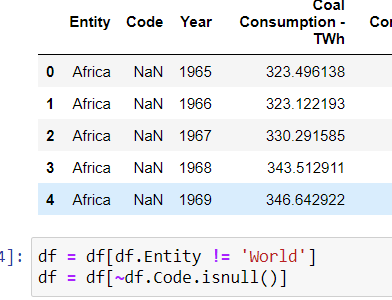

Total energy consumption by country was derived:

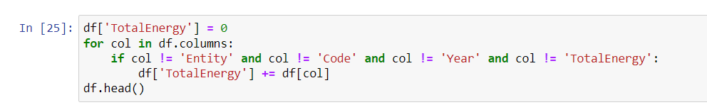

The energy consumption dataset was joined with the population dataset to calculate the per capita energy consumption:
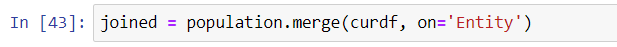
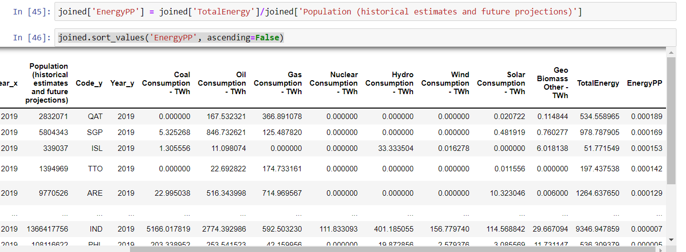
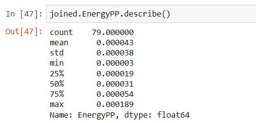

The CO2 emission per fuel type consumed was calculated manually using the CO2 emissions by fuel dataset:
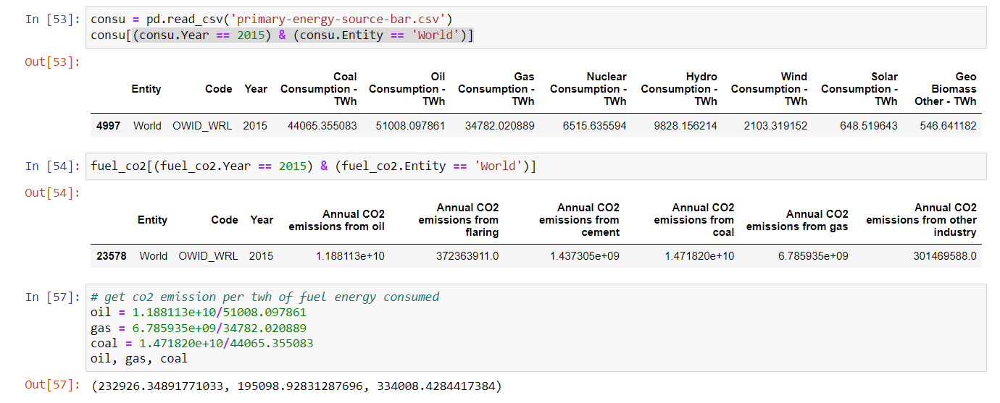

## System Design. 
- How will you display your data? What types of interactions will you support? 
- Provide some sketches that you have for the system design.

**Energy consumption by country split by fuel type (renewable/non-renewable) on the world map:**
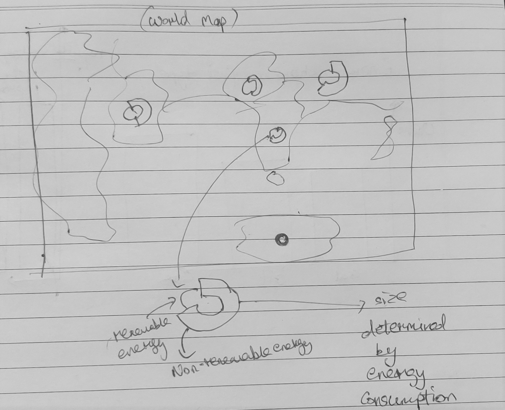

The basic idea behind this visualization is to convey the overall fuel consumption by country split further by fuel type. We hope to overlay each country by a circle which will be further split by line thickness, with the thinner line indicating the share of renewable energy and the thicker line indicating the share of non-renewable energy. Just by looking at this visualization alone, the viewer will get the impression that the biggest CO2 producers are countries like China, India, and the USA. However, we will give the user a button to change the visualization into the following one:

**Per capita energy consumption mapped to the world map:**
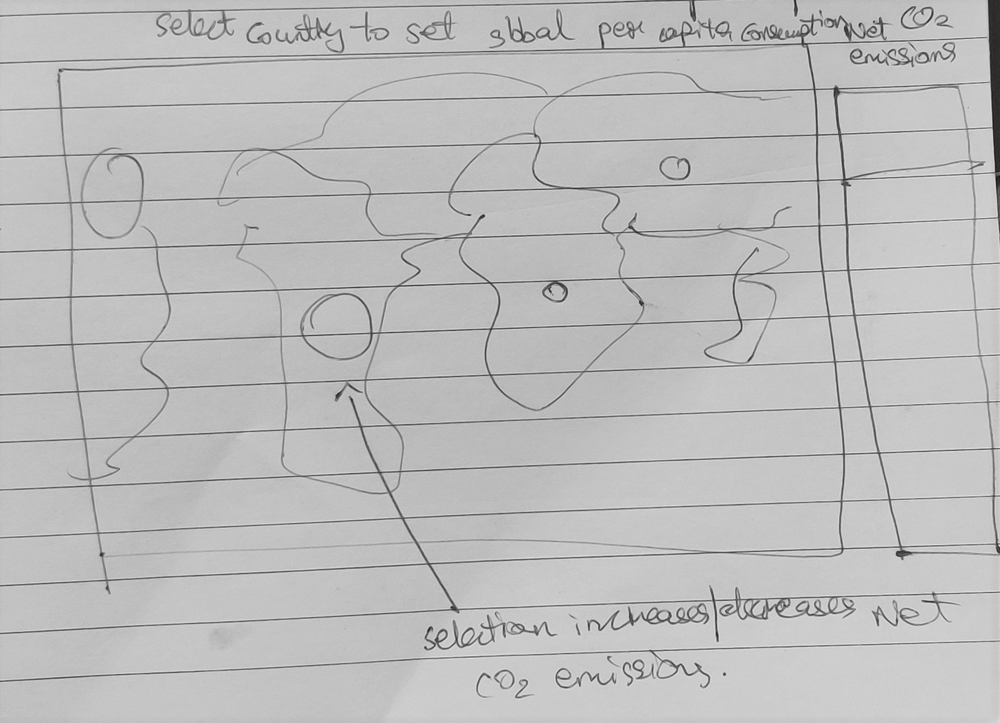

This visualization will show the same world map, but with circles overlaid over countries with size proportional to the per capita energy consumption of the country. According to our data analysis, countries like China and India will now be much lower in the ranking if we measure by per capita energy consumption, while countries like Qatar, Singapore, Iceland, UAE will be at the top (biggest overlaid circles). The aim of this visualization is to convey that richer countries consume energy at a much higher rate per person than poorer countries. If we are expecting these poorer countries to develop, their energy consumption will be much higher in the future than it is now. 
**Interaction supported**: This world map will allow users to select a country to set the world per capita energy consumption rate. For example, clicking on USA would set every country’s rate to that of the USA. There will be a bar on the right indicating net CO2 emissions which will go or down depending on the net emissions calculated based on the selected rate. This will help the user realize that if every country consumed energy at the rate of richer countries, the CO2 emissions will be much higher. Thus, there is a need to build plans where the world can accommodate the growth of poorer countries.

**Energy split by fuel source:**
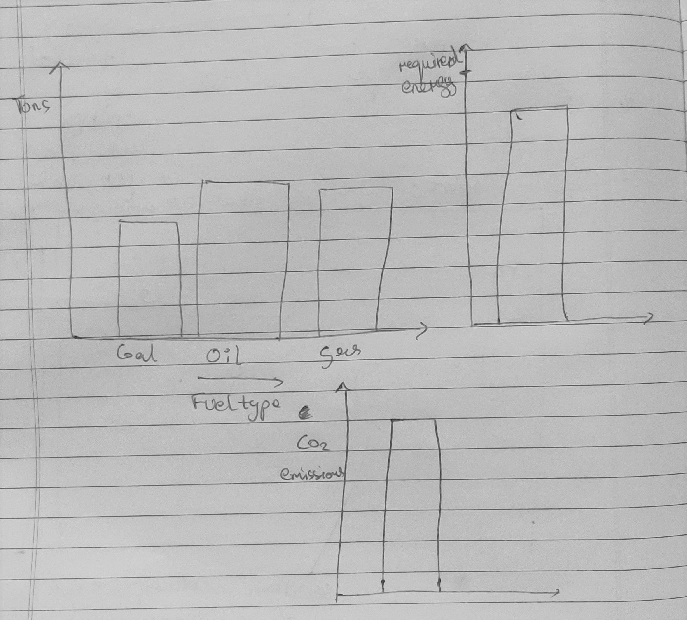

This visualization will have three interlinked bar charts. The first chart (clockwise from the top left) will show the current split of world energy production by fuel source type, the second chart shows the net combined energy produced using these fuels along with a marker indicating the current energy requirement, and finally the third chart shows the net CO2 emissions given this energy source combination. The idea is to allow the user to control the proportion of each fuel type in the energy mix. Changing a proportion would change the net energy production as well as the net CO2 emissions.

# Dataset Group 2
Data Processing 
Do you have to do substantial data cleanup? 
No, we just dropped any null values that were present in the final_dataset1 and final_dataset2 files 

What quantities do you plan to derive from your data?
1)Impact of mitigation strategies preventing climate change
2) Action taken by cities to battle climate hazards
3)Population of each country actively working towards reducing emissions,saving energy and increasing the use of renewable energy.

How will data processing be implemented?  Show some screenshots of your data to demonstrate you have explored it.
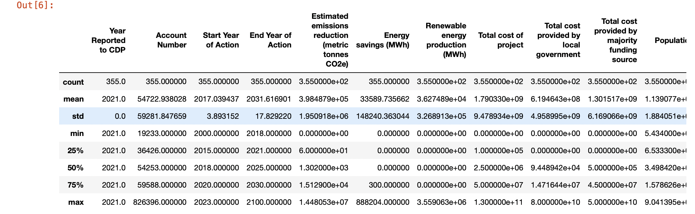

System Design
How will you display your data?

What types of interactions will you support? Provide some sketches that you have for the system design.

Datasets:
https://data.cdp.net/Mitigation-Actions/2021-Cities-Emissions-Reduction-Actions/rebb-tb9h :final_dataset1.csv
https://data.cdp.net/Adaptation-Actions/2020-Cities-Adaptation-Actions/feaz-9v5k/data :final_dataset2.csv

GRAPH 1 - DRILL DOWN BAR CHART(COUNTRY SPECIFIC CLIMATE HAZARDS AND ACTIONS TO BE IMPLEMENTED)

Upon choosing the country the bar chart including different climate hazard will display. And upon choosing a particular climate hazard the possible action plans to be implemented will be displayed from most effective to least. 

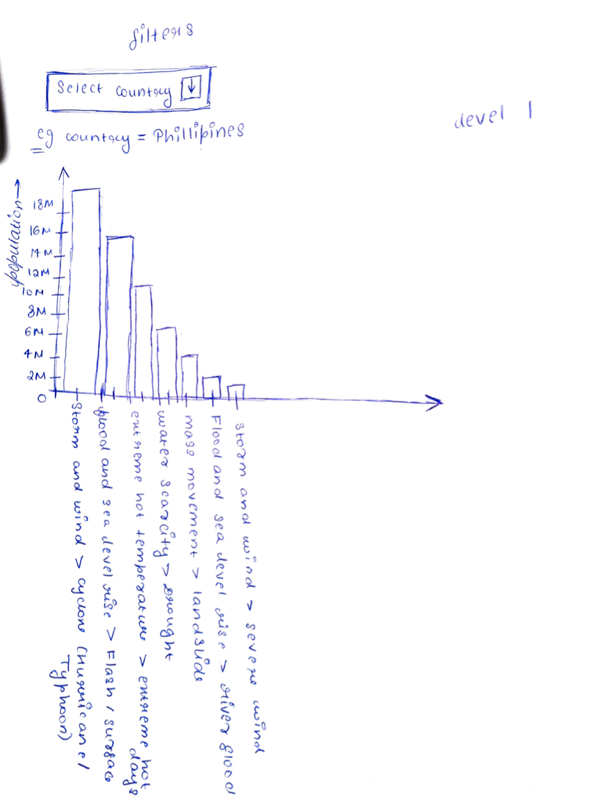
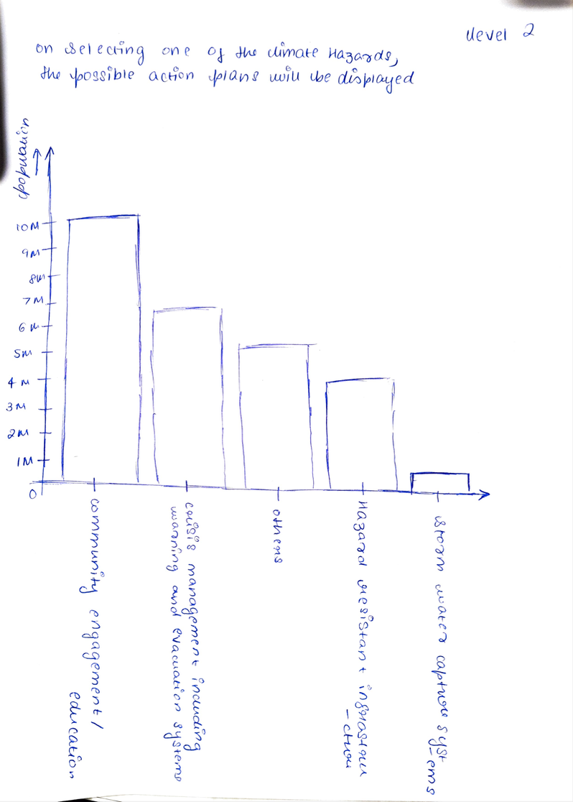

GRAPH 2 - IMPACT OF MITIGATION STRATEGIES PREVENTING CLIMATE CHANGE

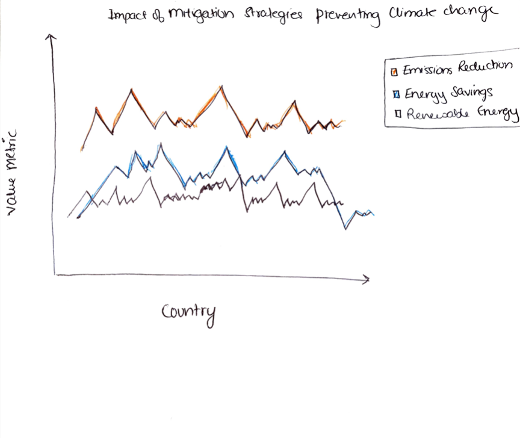

Comparing the emission reduction rate, energy savings and renewable energy saved of all countries when mitigation strategies are coming to effect. 

GRAPH 3 - GEOMAP REPRESENTATION OF COUNTRIES ACTIVELY PARTICIPATING IN TAKING ACTION AGAINST CLIMATE CHANGE
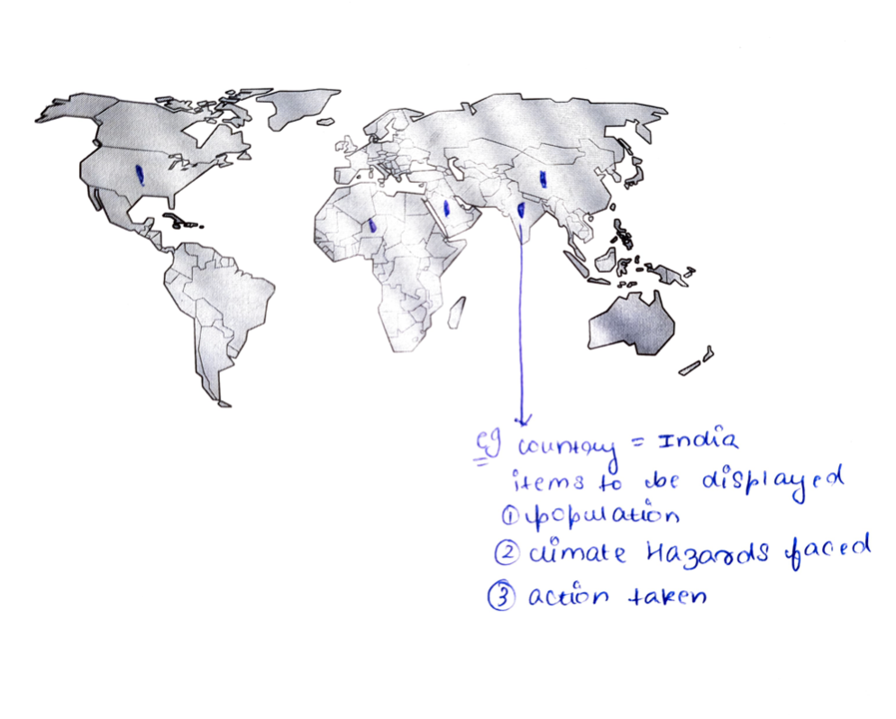

Upon selecting a particular country on the geomap it will display the climate hazard frequently experienced, action taken to prevent drastic effects of the climate hazard from occurring and population actively involved in preventing the climate hazard through its efforts. 

