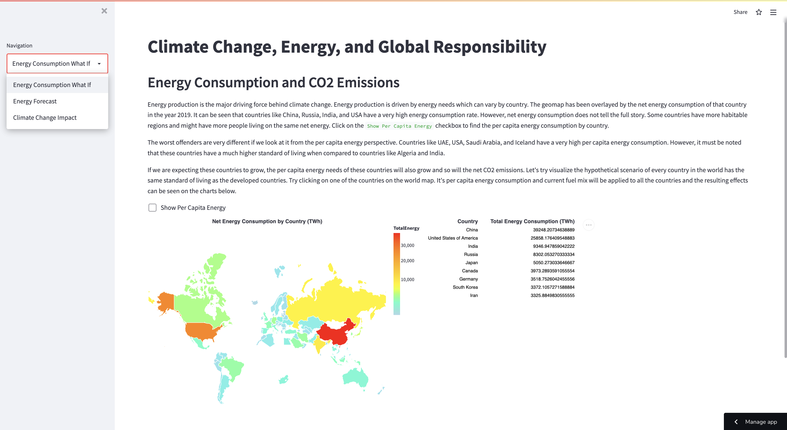
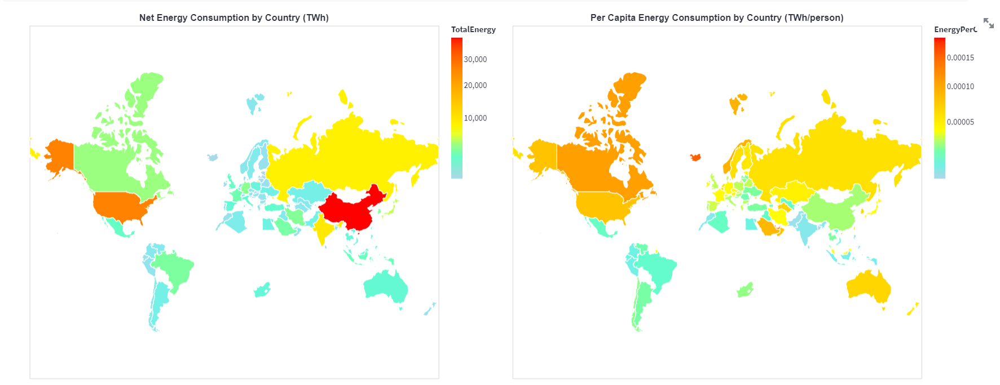
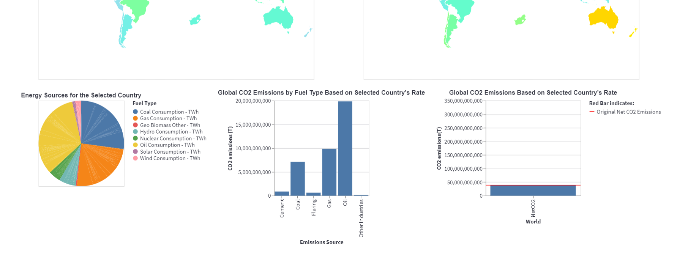
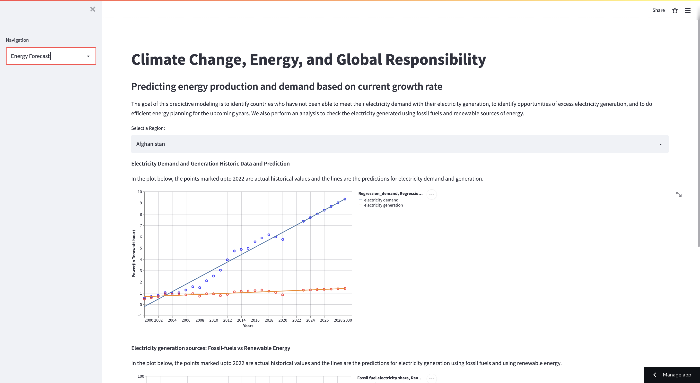
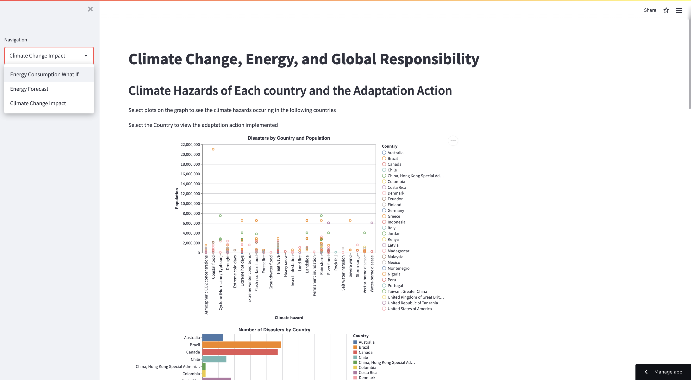

# CMU Interactive Data Science Final Project

* **Online URL**: https://share.streamlit.io/cmu-ids-2022/final-project-atd-2/main
* **Report Link**:https://github.com/CMU-IDS-2022/final-project-atd-2/blob/main/Report.md
* **Video Recording Link**:https://github.com/CMU-IDS-2022/final-project-atd-2/blob/main/recording.mp4
* **Team members**:
  * Contact person: tkalia@andrew.cmu.edu 
  * dpoddar@andrew.cmu.edu 
  * dhruvary@andrew.cmu.edu 
  * anami@andrew.cmu.edu 
  
## Abstract
Climate change is an area of growing concern, and its impact can be seen in various sectors of society throughout the world. While this is a vast topic, for the purposes of our final project we have narrowed it down to a few specific areas and questions. Climate change can be analyzed in terms of increase in energy consumption, increased Co2 levels and natural disasters. However, the effects of climate change can be far more complex than what such a simple analysis would indicate. We have built visualizations that convey the subtle effects of climate change.

Data Science tools and analysis plays a huge role in combating climate change. Analyzing the various data sources allowed us to come up with very insightful questions which we have answered with the help of our visualizations. 

The energy consumption visualization consists of world maps incorporating heat maps which visibly reflects the amount of energy consumed by each Country in the world. But this energy consumption of each country will not be at the same level due to various external factors and hence we have also provided energy level consumed per capita to get the equivalent energy consumed across all states.
The energy prediction chart uses the concepts of Machine learning and linear regression to estimate the amount of energy that will be consumed soon. This will allow government bodies to make calculated decisions about how to reduce the consumption.
The Climate impact and Actions implemented graph displays the various types of climate Hazards that have occurred across Countries and will allow individuals as well as Government Organizations to understand which action is to be implemented if a certain natural disaster occurs. These actions have helped reduce the emission of carbon dioxide as well.
We will explore these insights in further detail with the help of our visualizations.

## SUMMARY IMAGE

  

## Work distribution

We went through various datasets and research papers before finalizing out topic. Daily brainstorming of ideas allowed us to choose to develop our project on the causes and impact of Climate change. For the literature review process each one of us took up a research paper and analyzed it thoroughly to come up with interesting questions that we could answer.

We decided to select four key areas and come up with visualizations for the following:

1)  Energy Consumption

2)  Energy Prediction

3)  Impact of Climate Change

4)  Actions to be implemented against Climate change

We first came up with rough sketch ideas for each area and got feedback regarding the sketches from the TA's. This allowed us to improve on areas that we were lacking in.
Dhruv worked on the visualizations related to the energy consumption, Anam worked with the prediction visualizations, Trisha and Disha worked on the Impact of Climate change and the actions to be implemented against Climate change.

## Running Instructions
Install the dependencies:
`pip install -r requirements.txt`
Then run the application:
`streamlit run streamlit_app.py`

## Deliverables

### Proposal

- [X] The URL at the top of this readme needs to point to your application online. It should also list the names of the team members.
- [X] A completed [proposal](Proposal.md). Each student should submit the URL that points to this file in their github repo on Canvas.

### Sketches

- [X] Develop sketches/prototype of your project.

### Final deliverables

- [X] All code for the project should be in the repo.
- [X] Update the **Online URL** above to point to your deployed project.
- [X] A detailed [project report](Report.md).  Each student should submit the URL that points to this file in their github repo on Canvas.
- [X] A 5 minute video demonstration.  Upload the video to this github repo and link to it from your report.
