# Final Project Report

**Project URL**: https://share.streamlit.io/cmu-ids-2022/final-project-atd-2/main

**Video URL**: https://github.com/CMU-IDS-2022/final-project-atd-2/blob/main/recording.mp4

Short (~250 words) abstract of the concrete data science problem and how the solutions addresses the problem.

## Introduction
Climate change is increasingly becoming a very important topic across the world. Every few days, nature keeps giving us warnings of depleting natural resources and worsening climates. 
The most recent of these warnings are coming in the form of violent storms in Africa and severe heat waves in India, Pakistan and parts of South Asia. 
As humans, we have a social responsibility towards climate change. There are a few major countries across the world who hold a bigger responsibility than others based on their increased usage of resources. We believe the two major aspects that countries can work on are: 
1. Monitoring energy production and demands in order to manage natural resources required for energy generation, facilitate sharing of resources and energy and evaluate and act upon potential repercussions of high energy consumption.
2. Managing disasters through short term as well as long term initiatives in order to prevent loss of human lives, assets and to reduce environmental impact. 

Energy production is the major driving force behind climate change. Energy production is driven by energy needs which can vary by country. In our analysis, we analyze the country-wise net energy consumption for the year 2019. This helps us identify the countries with major consumption. However, net energy consumption does not tell the full story. Some countries have more habitable regions and might have more people living on the same net energy. Hence, we further provide visualizations to identify and analyze per capita energy consumption by country. 

Next, we go on to predict energy demand and energy generation for each country based on historical data using a Regression model. The goal of this predictive modeling is to identify countries who have not been able to meet their electricity demand with their electricity generation, to identify opportunities of excess electricity generation, and to do efficient energy planning for the upcoming years. We also perform an analysis to check the electricity generated using fossil fuels and renewable sources of energy.

Lastly, we conduct a detailed analysis of disasters by country and population. This analysis can be useful in analyzing the frequency and geography of the disasters in order to do better mitigation planning and disaster management. Moreover, we also conduct a detailed analysis of adaptation actions taken by various countries by population. This, again helps in better planning mitigation and disaster management.

## Related Work
Climate change is an area of growing concern, and it is an extremely vast domain. While brainstorming and researching, we came across various factors which play a huge role in the onset of climate change. Some of these as listed by the United Nations are:
 
1)The generation of power and increased Co2 levels
The generation of electricity by the burning of fossil fuels results in the emission of a large amount of greenhouse gases such as carbon dioxide which in turn traps the suns heat. Cities across the world produce around 60% of the greenhouse gas emissions [1]. Households contribute to about 21% per cent of resultant CO2 emissions [2].
 
2)Energy consumption
According to data provided by the United Nations, the cities consume about 78% of the world’s energy [1]. Even though there have been several technological advances, it is predicted that the energy consumption will increase by 35% in the upcoming year [2].
 
3)Deforestation
Cutting down of trees in forest lands leads to a heavy increase of around 23% of man-made Co2 emissions. Forests also have a major effect on the local weather of each area. Even if we take steps of replanting trees in other areas, it can lead to climate change. For example, planting more trees in a snowy region might contribute to a warmer climate [8].

**Analysis of Research Papers**

1) Communicating Climate Risk As mentioned in the analysis done by the World Meteorological Organization, to combat climate change, it is very important to rely on climate prediction as it will help us make calculated decisions. Climate projection is a scientific informed decision being made. There are two steps in this, one involving the science and second is the analysis of preexisting datasets.[4]

2) Climate and weather are two different elements in scientific literature. Weather represents a short-term variability whereas climate represents trends taking place in a region over time. Hence it is important to make sure future projections rely on climate change and not on weather change. There are still quite many uncertainties related to the Earths model with respect to climate, but it is essential to use any existing study to predict climate change.[5]

3) Risk Perception
In the United States of America about 63% of the population believes in climate change, however it still ranked 17 amongst a list of 19 most major issues faced in the USA.[6] Hence there is a lack of urgency amongst the government to take actions to combat climate change. There is also a study that states that the lack of disbelief between plan and action is in the way an induvial processes risk. It states that humans react less and take less action when the threat or problem is something abstract and something that they are unable to visualize.
 
4) Unpredictability
Since climate change cannot be contributed to just a single event it becomes quite difficult to find an exact source of the problem as well as just one solution. Every geographical location is affected differently and has different adaption actions to combat climate change. Hence every country should assess the problem of climate change not only on a global scale but on an individual level as well.

 
After analyzing datasets as well as the research papers as mentioned above, we narrowed it down to a few specific areas and questions surrounding Energy consumption and increased levels of Co2 on a global basis. The questions we came up with during our research were the following:

 
1.  Countries across the world have different levels of energy consumptions due to a various factors like population, amount of commercially traded energy sources and hence we wanted to understand what the equivalent level of energy consumption was for each country. We wanted to investigate how visualizations can be used to convey this idea.

 

2.  We want to convey and quantify how much control each country has over climate change. Are decisions being made by the government bodies with respect to the climate hazards faced in each country? Are there steps being taken to actively implement policies to help reduce the impact of climate change? Are individuals aware of the urgency of the situations and are they participating in campaigns to reduce the impact of climate change? We want to convey these points using our visualizations.

3.  We also want to focus on making it easier for countries to have     access to the change in climate on a monthly/yearly basis in the form of a visualization, rather than trying to gain insights directly from reading thousands of numbers loaded in the datasets.

4.  Prediction of the energy consumed would be highly beneficial for each country to assess the steps they have to take with regards to saving energy in the coming years. Hence we decided to use Machine learning concepts and linear regression to predict the energy that will be consumed in the near future. Will these future trends in energy consumption will allow the countries to handle the energy demand?

5.  Given that some effects of climate change are inevitable --- which countries will be the most affected and how can they be helped?

 Our research also involved analyzing the market and our target audience was defined as:

1)Individuals of each country will have access to these visualizations which will increase the urgency of the impact of climate change.

2)We also aim to make the visualizations useful enough to be useful for government bodies of countries who will be able to make calculated decisions based on the data and predictions provided via the visualizations created.

**Datasets**

After going through multiple datasets to answer the questions mentioned above we decided to work with the ones mentioned below as we were able to gain insights and reflect these findings in the terms of visualizations.

-   primary-energy-source-bar.csv

> Source: Primary energy consumption by source, 2020
> (ourworldindata.org)
>
> This dataset has data about energy consumption by fuel type per country for a big range of years.

-   population-past-future.csv

> Source:
> [[https://ourworldindata.org/india-will-soon-overtake-china-to-become-the-most-populous-country-in-the-world]{.ul}](https://ourworldindata.org/india-will-soon-overtake-china-to-become-the-most-populous-country-in-the-world))
>
> This dataset has historical population by country.

-   Co2-emissions-by-fuel-line.csv

> Source: ([[https://ourworldindata.org)]{.ul}](about:blank)
> This dataset has CO2 emissions by fuel type per country.

-   final_dataset1.csv

> Source:[[https://data.cdp.net/Mitigation-Actions/2021-Cities-Emissions-Reduction-Actions/rebb-tb9h]{.ul}](https://data.cdp.net/Mitigation-Actions/2021-Cities-Emissions-Reduction-Actions/rebb-tb9h)
>
> This dataset consists of the action taken by cities to combat climate change.
>
>  

-   final_dataset2.csv

> Source:
> [[https://data.cdp.net/Adaptation-Actions/2020-Cities-Adaptation-Actions/feaz-9v5k/data]{.ul}](https://data.cdp.net/Adaptation-Actions/2020-Cities-Adaptation-Actions/feaz-9v5k/data) 
>
> This dataset consists of the climate hazards occurring in each city and the action that adapted to combat the climate change.
>
>  

-   Owid-energy-dataset.csv

>   Source :https://github.com/owid/energy-data
> This dataset consists of key metrics related to energy consumption.

## Methods
We implemented three different types of Visualizations:

1)  **Energy Consumptions and Co2 emissions**

2)  **Energy Consumption Prediction**

3)  **Climate Change Impact**

**2)Energy Demand and Generation Prediction**

We performed a total of 4 detailed analyses of the following:

1.  Electricity demand by country.

2.  Electricity generation by country

3.  Electricity generation by country using fossil fuels.

4.  Electricity generation by country using renewable sources of energy.

 We used a similar pipeline in order to perform all the above analysis of electricity demand and generation. The detailed methodology for the same is listed as follows:

1.  User Interaction- The design on our dashboard involves a
    selection box for country selection. The user selects a country from
    a list of all countries.

2.  Data Filtering - The data is filtered based on the user
    selection.

3.  Data Cleaning - The data is cleaned by dropping N/A values
    for both electricity demand and generation columns.

4.  Model Training - A linear regression model is fit on the
    years vs electricity demand and years vs electricity generation.

5.  Prediction -  next 10 years - The linear regression model is
    then used to predict the electricity demand and generation values
    for the next 10 years.

6.  Visualization - The raw year-wise electricity generation and
    electricity demand power is then plotted along with the regression
    plots for the same.

The above methodology provides an easy and interactive way of analyzing energy demand and prediction.

**3) Climate Change Impact**

​​With the increase in climate hazards due to climate change it is
highly essential for each country to act against it. The visualization
consists of interactive graphs which are multi connected to each other
thereby displaying the possible action plans that can be adopted to
reduce the C02 levels

1.  **Data cleaning:**  We first cleaned the data files  by dropping all the null values. Once we had the cleaned datasets, we analyzed it to pick relevant columns which would answer the questions mentioned above. The datasets primarily consist of the different kinds of hazards faced by each country and what action plan should be implemented to combat it.

2.  **Library used:** We used the python library Altair to create these interactive charts.

3.  **User Interactivity Graph 1:** The first scatter plot allows the user to make an interval selection of the different kinds of climate hazards. This feature was implemented by using the brush feature which allows a continuous selection of more than one feature. The plots depict the different countries as displayed in the legend.

4.  **User Interactivity Graph 2 &3:**  The scatter plot is connected to the bar chart so that it automatically updates the number of disasters. We also added a selector to the graph which allows the user to select a particular country to view the adaption actions that should be implemented.
    
5.  **User Interactivity Graph 3:** A drop down was added using the list and drop-down feature of python which allows a user to select a particular country. This allows. The selection of a particular country in order to see which action was implemented and by how much had the CO2 levels reduced.

## Results
**Energy Consumptions and Co2 emissions**

Debates about climate change at the diplomatic level often break down to assigning blame for who is responsible for climate change. While working with the implicit assumption that ultimately, climate change is a global problem, we wanted to build a visualization to let users explore this aspect on their own. 
At its core, human activity that causes climate change can be quantified in terms of energy consumption. We used energy consumption as a metric to identify from which countries climate change is being driven the most. The first visualization shows net energy consumption as a heat map:

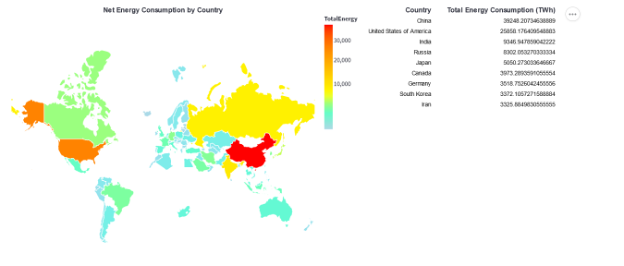

The table on the right shows the net energy consumption by the top ten consuming countries. This can be quickly used by a user to get an idea of which countries are more responsible. However, net energy consumption is not a sufficient metric, energy can come from clean fuel sources, plus different countries have vastly different population sizes. While this visualization whets the appetite of the viewer, the next visualization addresses these issues.

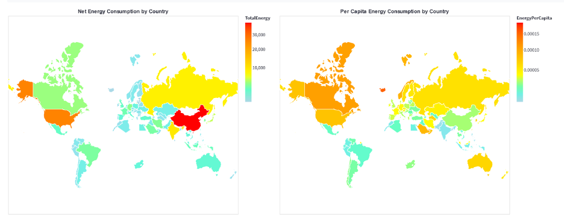

This visualization shows the per capita consumption by country on the side. The viewer can compare the net energy consumption and the per capita energy consumption of each country on the map. A quick glance is enough to see that countries with very high net energy consumptions don’t necessarily have very high per capita consumptions. This visualization also serves as a proxy for identifying developing countries (low per-capita consumption). 
The next set of visualizations are linked the world map above and they show important metrics like fuel source of the energy, co2 production by fuel, and net co2 production.

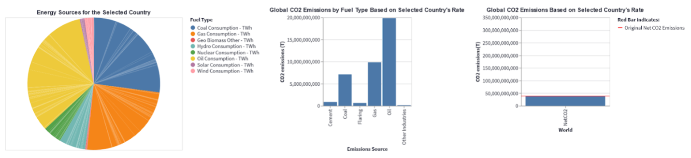

When no country has been selected on the world map, these graphs show overall metrics for the whole world. The viewer can use these visualizations to gain insights like which fuel type is being used more or which fuel type produces the most CO2.
More importantly, the viewer can select a specific country on the world map to first view the fuel mix and their energy contribution for that country. 

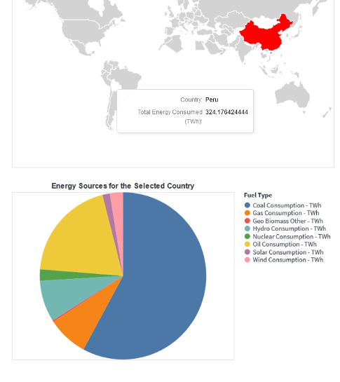

Next come the more interesting two visualizations:

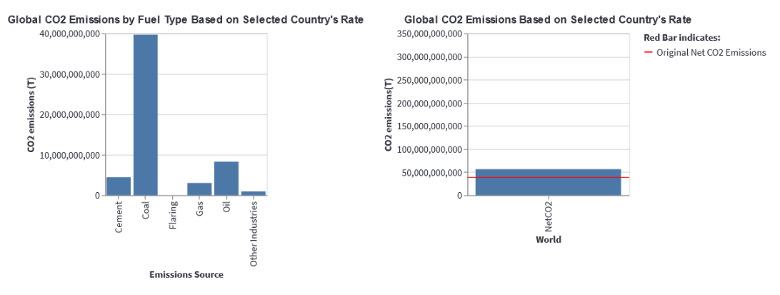

These visualizations use the methods described in the previous section to use this specific country’s consumption and fuel data to infer what would have happened if the whole world had this level of consumption. The global CO2 emissions chart on the right shows the net CO2 emissions based on this inferred data as compared to the emissions that we have right now (red line). This can be easily used by the viewer to do a comparative analysis between the sustainability of lifestyles of people across different countries.

**Energy Demand and Generation Prediction**

The energy demand and energy generation predictive modeling is done using data made available publicly under the Creative Commons license by “Our World in Data”.  Using the methodology detailed in the method section for electricity demand and generation, we obtain a series of visualizations(one for each country), which can be used for a detailed analysis. 

Let’s look at an example for the same: Suppose we want to analyze the electricity demand and generation for Canada,  Our tool generates the following visualizations:

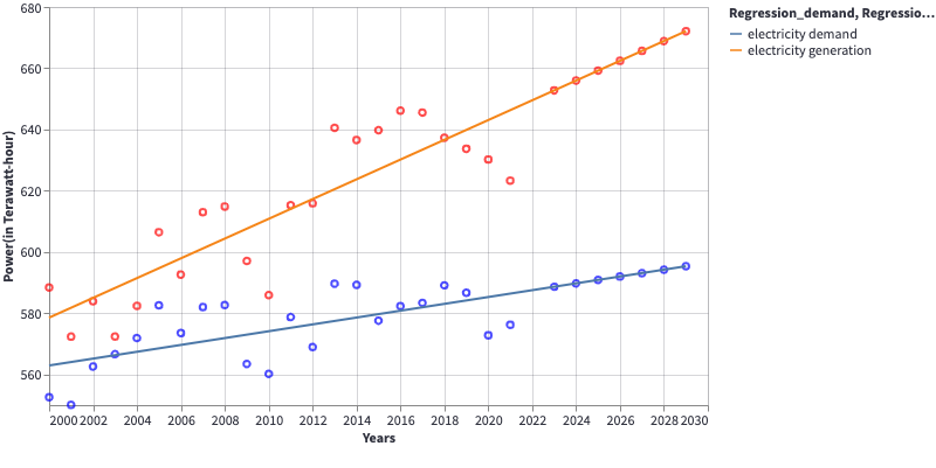

As can be seen, there is already a trend evident from the above graph, which points to the fact that the electricity generation for the country is growing  at a faster rate than its electricity demand, and the predictions show that it is only going to continue and the gap between electricity generation and demand will further widen which is a great sign for a country.  The second visualization also shows that Canada has slowly been reducing its dependence on fossil fuels and moving towards more renewable sources of energy.
 

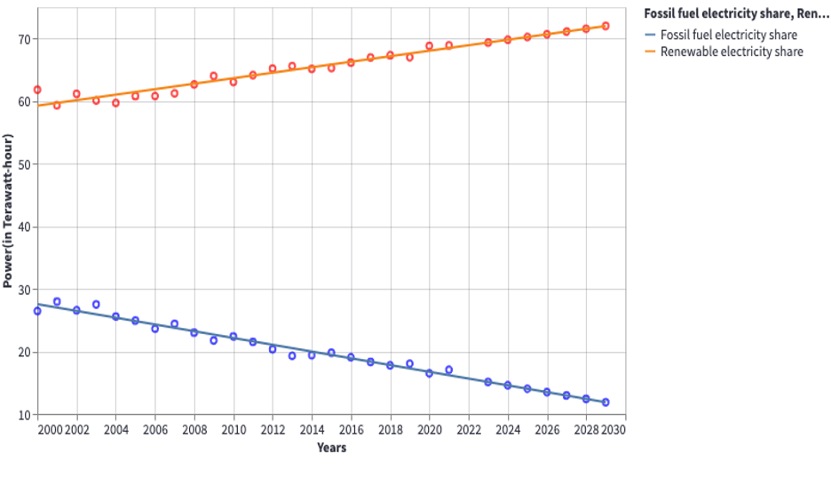
**Climate Change Impact**

The first scatter plot graph displays the climate hazards occurring in countries with respect to the population of each country.The user can select an interval from the scatter plot.This feature allows the user to view multiple climate hazards which has occured in the countries.The countries are color coded as displayed in the legend on the right and multiple countries can be selected once.

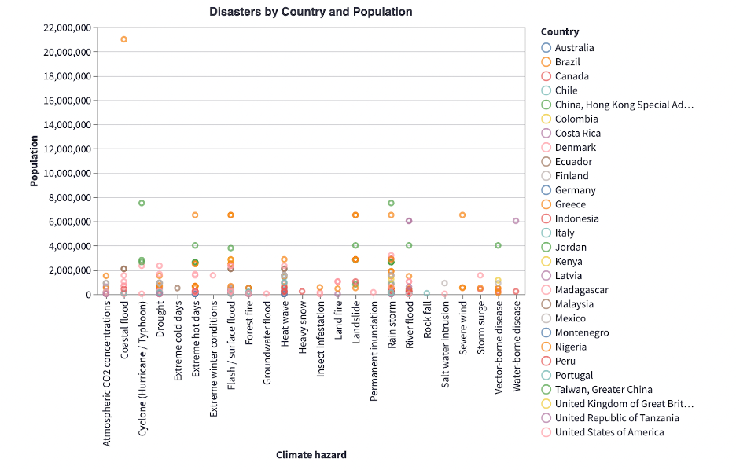

This second bar chart will automatically change depending on the interval selection.This allows the user to see which country had the highest number of disasters.It will change depending upon which climate hazards were selected in the scatter plot in the above graph and hence it is multi connected.

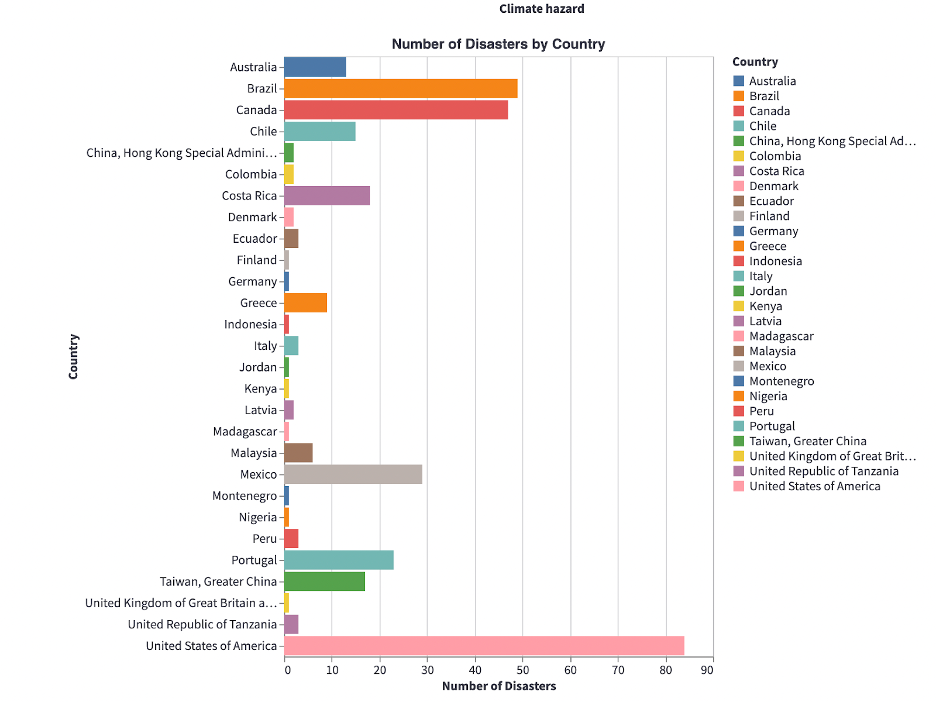

The third visualization consists of a drop down which allows the user to select the country that they want.On the selection of the country, it will display the population of the country in the form a bar chart. It will also simultaneously display the amount of CO2 levels which were reduced on the implementation of that particular action.

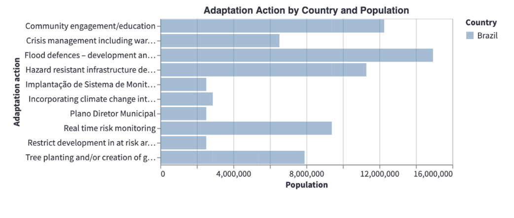

## Discussion
**Energy Consumptions and Co2 emissions**

The comparative visualization with the net energy consumption and per capita energy consumption side-by-side gives the user a complete picture of global hotspots of human activity and consumption. One insight that can be drawn from this chart is that while countries like China and India have a very high net consumption, it is the smaller countries like Iceland and Saudi Arabia that lead the world in per capita energy consumption.

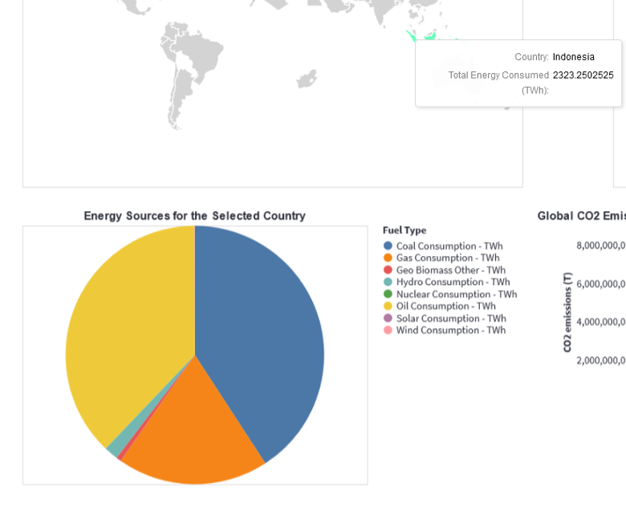

Another interesting trend is that developing countries like Indonesia, India, and China all have significant energy being produced using coal and oil, which are highly emitting sources of energy.

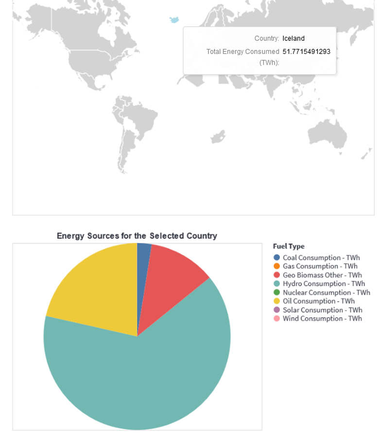

This can be contrasted with Ireland which has a high reliance on
hydroelectric power for energy. 

The next visualization helps drive home the observation that coal and oil are in fact dirtiest fuel sources:

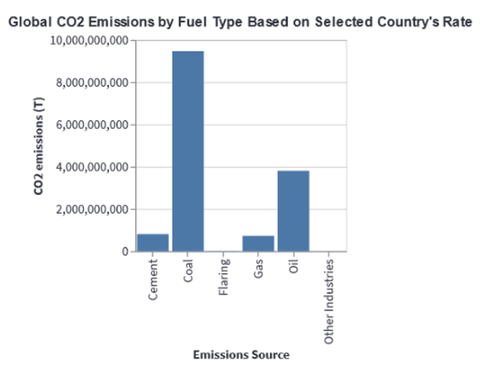

Finally, the most important insight here is that if everyone consumed like the developed countries, we would be in a much worse state than today. This is the net CO2 emissions of every country in the world consumed in the USA.

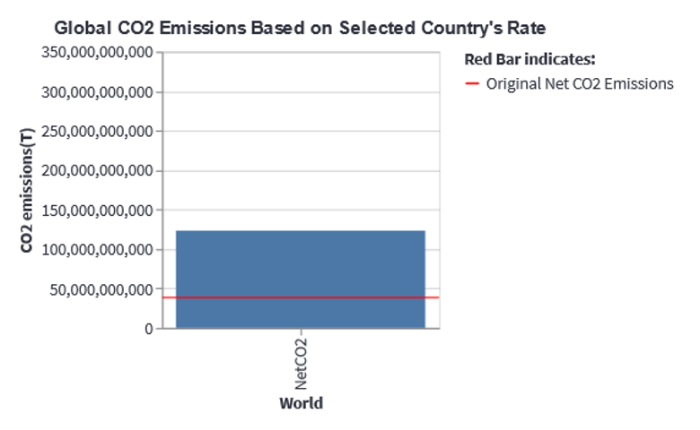

It can be seen that the net CO2 emissions are several times higher than the current net CO2 emissions of the world.

**Energy Demand and Generation Prediction**

Looking at this analysis, the government can take necessary measures to plan out their investments and strategies for the upcoming years in order to ensure that the country's energy requirements are met. From a climate change perspective, this also helps a country understand that their energy needs are growing and there can possibly be plans in place to generate electricity using clean methods like water, air and solar energy. The second visualization directly helps countries directly monitor their electricity generation using fossil fuels and renewable energy. Using all these analyses, the country can also plan actions to reduce energy consumption.

**Climate Change Impact**

As seen in the graph below, when we select climate hazards(displayed by the gray box in the scatterplot) like forest fires,landslides,floods,insect infestations etc ,the bar graph below will automatically display the total number of these disasters has occurred in which country.Here as we can see brazil has the highest number of Climate Hazards around 20 whereas Canada, China and Madagascar has the lowest number of these climate hazards.

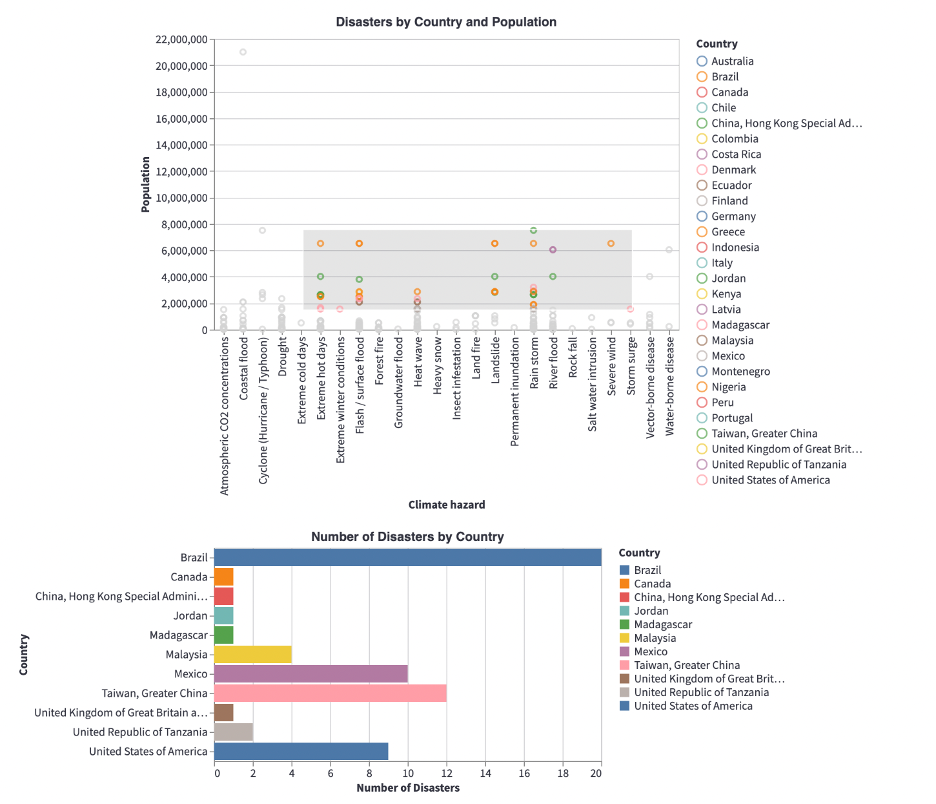

The user can now select whichever country they want to in order to view what actions should be taken in order to combat each of these climate hazards. On selecting Brazil we can see the following action plans pop up in the form of a bar chart. Since Brazil is a developing country, one of the suggested action is education as well as community engagement. It extremely essential to take steps to educate the citizens of the country all the repercussions that climate change leads to. This will help increase the urgency amongst the impact of climate change. The government should  also allocate a part of the budget every year to implement various policies which helps combat climate change as well as take active measures to set up campaigns where people will actively participate to reduce the CO2 emission levels.

The third visualization allows the user to select a country from the dropdown list.It will then display the actions which were implemented in that country. These actions which were implemented led to a significant decrease in the Co2 emissions.This visualization allows the user to see the impact the people of the country have made by actively participating in the campaigns and action plans taken by the government of the country. For example, on selecting Peru we can see that the actions implemented were introduction of a secondary water treatment plan as well as the introduction of electric buses.This led to a decrease in the Co2 levels by 16 metric tonnes and 5000 metric tonnes respectively.

These insights will be extremely useful to motivate more people to
actively help combat climate change.

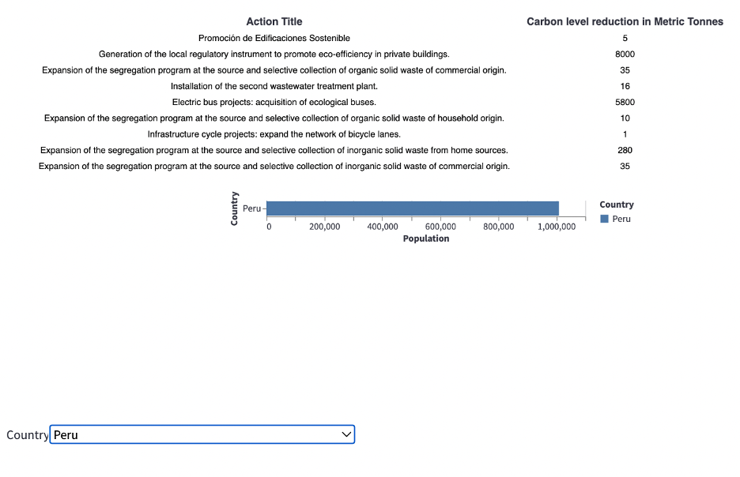

## Future Work
Stopping global warming is a combined global effort. Recently, during the United Nations climate convention there was a consensus for the political and business community to come together to stop climate change. Our visualizations have showcased the dire need for everyone to come together to stop the rapid change in climate. With the help of the insights from these visualizations we can help make a change in the real world and avoid the drastic climate change currently being experienced globally. 

The regression analysis that we carried out on our dataset was very helpful in generating a predictive model based on energy demand and generation. This predictive modeling proves to be very useful in understanding the future patterns a country is  looking at if no action is taken. This can be very useful to bring to notice to the governments of countries to immediately take action. Further analyses on these predictions could include specific regions within the country where electricity demand is exceptionally high and different strategies they can implement to reduce the consumption of electricity. These findings can be targeted to the specific audience so individuals can decrease their electricity consumption, in the long run contributing to reducing the pace of rapid climate change that is currently happening. 

The interactive world map is very engaging and insightful and can be used in classrooms to catch the attention of children on the trends of sources of energy and its contribution to climate change. The heat map definitely adds to the impact of different energy sources on the country. These findings can be extended to schools  or a TED talk to spread awareness amongst everyone, especially young adults who can make an impact by choosing to use renewable energy. While the world map will help give a comparative analysis of net energy consumption and per capita energy consumption side-by-side we can further explore other datasets to include common renewable energy sources that some governments are adapting to. Many governments have different climate agenda and are shifting focus to more efficient buildings and vehicles and incorporating other existing technologies such as wind and solar energy. We would love to explore the impact of such energy sources on the country and its contribution to carbon emissions and hence climate change. 

The visualization of the number of people in different countries impacted by climate hazards is concerning. This tool can be used further as a predictive model as well. For instance, if a country is predicted in recent years to  experience a similar climate hazard as the climate of the country predicts, certain action plans can be implemented to restrict the damage of the calamity.  Countries predicted to experience a climate hazard can implement strategies based on an action plan that has worked in the past for other countries.   

We are looking forward to exploring and applying our  visualizations in the future to create an impact. 

References

1. United Nations. (2020). Generating power. <https://www.un.org/en/climatechange/climate-solutions/cities-pollution>

2. M., Chassagne, T., Chassagne, T., M., A, R., M., D., & M. (2020, August 11). Sustainable consumption and production. United Nations Sustainable Development. <https://www.un.org/sustainabledevelopment/sustainable-consumption-production/>

3. Reporter, G. S. (2021, August 25). How do trees and forests relate to climate change? The Guardian. <https://www.theguardian.com/environment/2011/feb/11/forests-trees-climate>

4. WMO. (2015). Climate projections. Retrieved from <https://www.wmo.int/pages/themes/climate/climate_projections.php>.

5. Moser, S. C. (2010). Communicating climate change: History, challenges, process and future directions. Wiley Interdisciplinary Reviews: Climate Change, 1, 31--53. doi:10.1002/wcc.11

6. Leiserowitz, A., Maibach, E., Roser-Renouf, C., Feinberg, G., & Rosenthal, S. (2014b). Politics & global warming, Spring 2014. Yale University and George Mason University. New Haven, CT: Yale Project on Climate Change Communication.

7. Weber, E. U. (2006). Experience-based and description-based perceptions of long-term risk: Why global warming does not scare us (yet). Climatic Change, 77, 103--120. doi:10.1007/s10584-006-9060-3

8. Wilby, R. L., Charles, S. P., Zorita, E., Timbal, B., Whetton, P., & Mearns, L. O. (2004). Guidelines for use of climate scenarios
developed from statistical downscaling methods. Geneva: IPCC Task Group on Data and Scenario Support for Impact and Climate Analysis (TGICA). Retrieved from <http://ipcc-ddc.cru.uea.ac.uk/guidelines/index.html>

